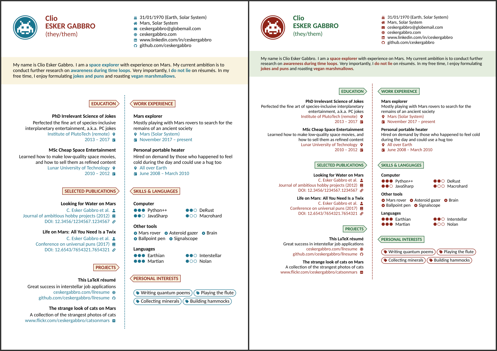

# Lean LaTeX Résumé

This project provides a LaTeX class `llresume.cls` to easily write lean résumés
using your favorite typesetting language.

## Usage

You can edit and compile the résumé on Overleaf or clone this repository and
compile it yourself. Look into [main.tex](./main.tex) for a comprehensive
example and for how to use this class.

## Showcase

The two images below showcase the look of `llresume`. The left-hand side image
is the default look, while the right-hand side image is the look with the
`compact` class option and some alternative colors. The corresponding PDF files
are inside the [showcase](./showcase) folder.

